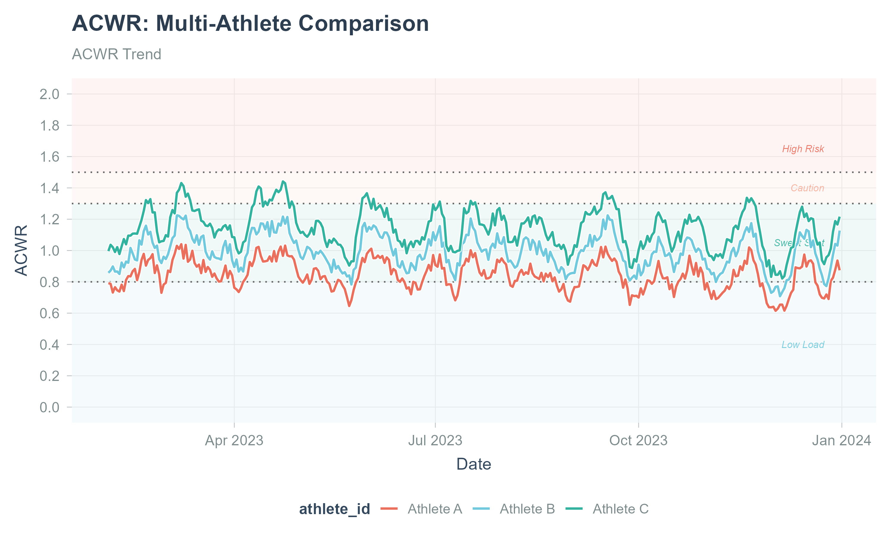
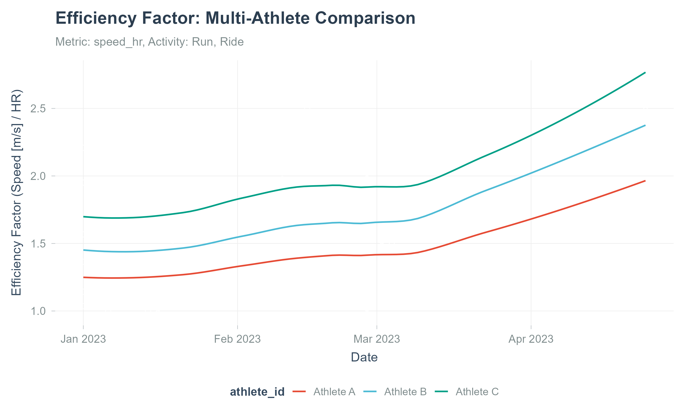
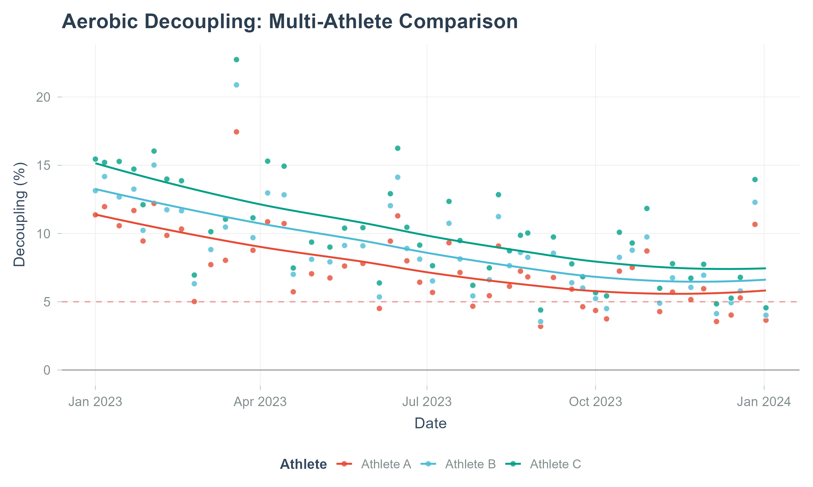

<p align="center">
  
</p>

<h1 align="center">Athlytics</h1>

<p align="center">
  <!-- Group 1: CI/CD, Reviews & Licenses -->
  <a href="https://github.com/ropensci/Athlytics/actions/workflows/R-CMD-check.yml"></a>
  <a href="https://github.com/ropensci/software-review/issues/728"></a>
  <a href="https://ropensci.github.io/Athlytics/"></a>
  <a href="https://app.codecov.io/gh/ropensci/Athlytics"></a>
  <a href="https://www.repostatus.org/#active"></a>
  <a href="https://opensource.org/licenses/MIT"></a>
  <br>
  <!-- Group 2: CRAN Release & Status (Moved to the back) -->
  <a href="https://cran.r-project.org/package=Athlytics"></a>
  <a href="https://CRAN.R-project.org/view=SportsAnalytics"></a>
  <a href="https://cran.r-project.org/package=Athlytics"></a>
</p>


## Overview

**Athlytics** is a research-oriented R package for the longitudinal analysis of endurance training. It operates entirely on **local [Strava](https://www.strava.com/) exports** (or FIT/TCX/GPX files), avoiding API dependencies to ensure **privacy** and long-term **reproducibility**.

> **What is Strava?** [Strava](https://www.strava.com/) is a popular fitness tracking platform used by millions of athletes worldwide to record and analyze their running, cycling, and other endurance activities. Users can export their complete activity history for offline analysis.

The package standardizes the workflow from data ingestion and quality control to model estimation and uncertainty quantification. Implemented endpoints include **acute-to-chronic workload ratio (ACWR)**, **aerobic efficiency (EF)**, and **cardiovascular decoupling (pa:hr)**, alongside personal-best and exposure profiles suitable for **single-subject** and **cohort** designs. All functions return tidy data, facilitating statistical modeling and figure generation for academic reporting.

## Key Features

* **Reproducible by design** - Fully offline; no API keys. Deterministic pipelines suitable for longitudinal studies.
* **Validated metrics** - Implements ACWR, EF, and decoupling commonly used in exercise physiology; integrated **QC** checks.
* **Uncertainty-aware** - Functions return estimates with variance/intervals where applicable, enabling principled inference.
* **Cohort support** - Built-in helpers for multi-athlete datasets and percentile-band references.
* **Tidy outputs** - Consistent, analysis-ready tibbles for downstream modeling and figure pipelines.


## 📦 Installation

**1. R-Universe (rOpenSci, recommended)**
```r
install.packages("Athlytics", repos = c('https://ropensci.r-universe.dev', 'https://cloud.r-project.org'))
```

**2. Development Version (GitHub)**
```r
# install.packages("remotes")
remotes::install_github("ropensci/Athlytics")
```

**3. CRAN (outdated; 0.1.2)**
```r
install.packages("Athlytics")
```
*The CRAN build does **not** include the offline-export workflow, the
time-weighted HR coverage fix, the continuous steady-block EF /
decoupling logic, zip-aware PB calculation, `time_basis`, the
`missing_load` knob, or any of the 1.0.x rOpenSci review fixes. Only
use it if you specifically need the legacy Strava-API pipeline.*

### Optional: FIT file support

Athlytics can parse activity stream files in TCX/GPX formats out of the box. **FIT support is optional** and uses **FITfileR**, which is installed from GitHub (not CRAN).

If your Strava export includes `.fit` files (and you want Athlytics to parse them), install FITfileR:

```r
if (!requireNamespace("remotes", quietly = TRUE)) install.packages("remotes")
remotes::install_github("grimbough/FITfileR")
```


## 🚀 Quick Start

### 📥 Step 1: Export Your Strava Data

0.  **Important**: Before requesting your export, set Strava language to **English** (Settings → Display Preferences → Language). This helps ensure the exported CSV column names match what Athlytics expects.
1.  Navigate to **[Strava](https://www.strava.com/)** and open Settings → My Account.
2.  Under "Download or Delete Your Account," click **"Get Started"** and then **"Request Your Archive"**.
3.  You'll receive an email with a download link - this may take some time.
4.  Download the ZIP file (e.g., `export_12345678.zip`). As of **1.0.5** the `.zip` can be passed directly to `load_local_activities()`, `calculate_pbs()`, and `calculate_decoupling()` via their `export_dir` argument; `calculate_ef()` still operates on activity summaries and therefore does not need `export_dir` for its main workflow. Unzipping into a directory is still supported and is a reasonable option if you plan to iterate over the export many times.

### 💻 Step 2: Load and Analyze (Cohort Example)

This example shows a common workflow: loading data for several athletes, calculating their training load, and comparing one athlete to the group average.

```r
library(Athlytics)
library(dplyr)

# 1. Load data for a cohort of athletes, adding unique IDs
athlete1 <- load_local_activities("path/to/athlete1_export.zip") |> mutate(athlete_id = "A1")
athlete2 <- load_local_activities("path/to/athlete2_export.zip") |> mutate(athlete_id = "A2")
cohort_data <- bind_rows(athlete1, athlete2)

# 2. Calculate ACWR for each athlete in the cohort
cohort_acwr <- cohort_data |>
  group_by(athlete_id) |>
  group_modify(~ calculate_acwr(.x, activity_type = "Run", load_metric = "duration_mins")) |>
  ungroup()

# 3. Generate percentile bands to serve as a reference for the cohort
reference_bands <- calculate_cohort_reference(cohort_acwr, metric = "acwr_smooth")

# 4. Plot an individual's data against the cohort reference bands
individual_acwr <- cohort_acwr |> filter(athlete_id == "A1")
plot_with_reference(individual = individual_acwr, reference = reference_bands)
```


## 📊 Core Analyses

All functions return clean, tidy `tibble` data frames, making it easy to perform your own custom analysis or visualizations.

### Training Load Monitoring (ACWR)

Track how your training load is progressing to avoid ramping up too quickly — a key metric for monitoring training progression.



*[Learn more about ACWR analysis](https://ropensci.github.io/Athlytics/reference/calculate_acwr.html)*

### Aerobic Efficiency (EF)

See how your aerobic fitness is changing over time by comparing your output (pace or power) to your effort (heart rate). A rising trend is a great sign of improving fitness.



*[Learn more about Aerobic Efficiency](https://ropensci.github.io/Athlytics/reference/calculate_ef.html)*

### Cardiovascular Decoupling

Measure your endurance by analyzing how much your heart rate "drifts" upward during a steady-state workout. A low decoupling rate (<5%) is a marker of excellent aerobic conditioning.



*[Learn more about Decoupling](https://ropensci.github.io/Athlytics/reference/calculate_decoupling.html)*


## 📐 Methods & Validation

This release implements widely used constructs in endurance-exercise analytics:
- **ACWR**: rolling acute (e.g., 7-day) vs chronic (e.g., 28-day) load ratios with smoothing options.
- **Aerobic Efficiency (EF)**: output (pace/power) relative to effort (heart rate) over time.
- **Cardiovascular Decoupling (pa:hr)**: drift between pace/power and heart rate during steady efforts.

**Important**: ACWR is a descriptive monitoring tool and should be interpreted with caution. It is not a validated injury-prediction model; see discussion in the sports science literature (e.g., DOI: 10.1007/s40279-020-01378-6).

We provide input validation, outlier handling, and activity-level QC filters (e.g., minimal duration, HR plausibility ranges). For cohort summarization, Athlytics computes percentile bands and supports stratification by sport, sex, or other covariates when available.


## 📝 Citation

If you use **Athlytics** in academic work, please cite the software as well as the original methodological sources for specific metrics.

```bibtex
@software{athlytics2025,
  title   = {Athlytics: A Reproducible Framework for Endurance Data Analysis},
  author  = {Zhiang He},
  year    = {2025},
  version = {1.0.5},
  url     = {https://github.com/ropensci/Athlytics}
}
```


## ⚖️ Ethical Considerations

Athlytics processes personal training records. Ensure appropriate consent for cohort analyses, de-identify outputs where required, and comply with local IRB/ethics and data-protection regulations.


## 🤝 Contributing

Contributions are welcome! Please read our [CONTRIBUTING.md](CONTRIBUTING.md) guide. Please note that this package is released with a [Contributor Code of Conduct](https://ropensci.org/code-of-conduct/). By contributing to this project, you agree to abide by its terms.

*   **🐛 Report an Issue**: [Open an Issue](https://github.com/ropensci/Athlytics/issues)
*   **💡 Suggest a Feature**: [Start a Discussion](https://github.com/ropensci/Athlytics/discussions)
*   **🔧 Submit a Pull Request**: We appreciate your help in improving Athlytics.


## 🙏 Acknowledgements

This package has been [peer-reviewed](https://github.com/ropensci/software-review/issues/728) by rOpenSci. We thank [Eunseop Kim](https://github.com/markean) and [Simon Nolte](https://github.com/smnnlt) for their constructive reviews, and [Prof. Benjamin S. Baumer](https://github.com/beanumber) and [Prof. Iztok Fister Jr.](https://github.com/firefly-cpp) for their valuable feedback and suggestions.
