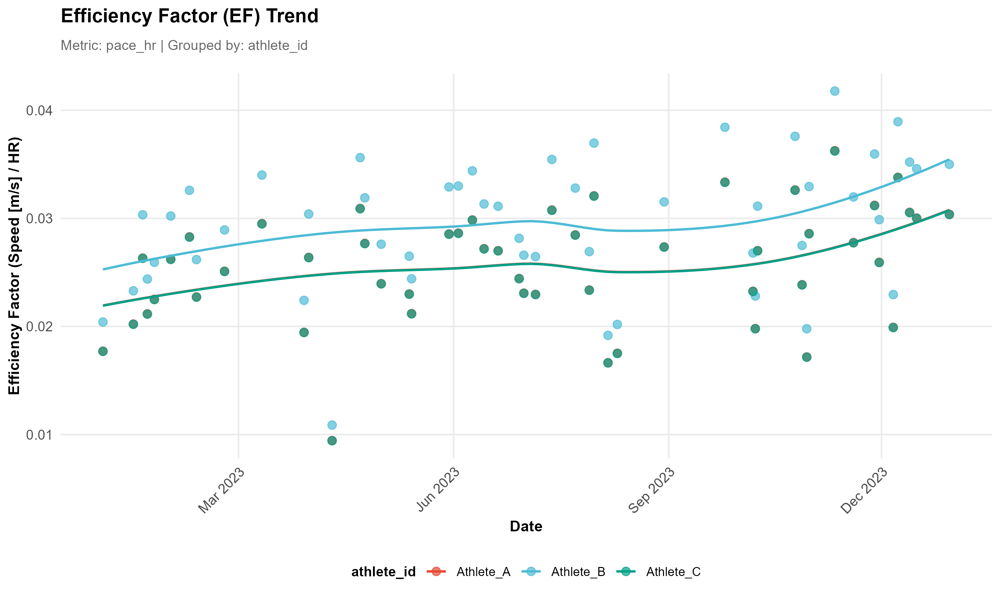

<div align="center">


# Athlytics
*An all-in-one, offline R toolkit for endurance analytics — from FIT/TCX/GPX & Strava exports to core models (ACWR, EF, Pa:Hr decoupling, PB, Exposure) with built-in QC & uncertainty.*

</div>

<p align="center">
    <a href="https://cran.r-project.org/web/views/SportsAnalytics.html"></a>
    <a href="https://cran.r-project.org/package/Athlytics"></a>
    <a href="https://cran.r-project.org/package/Athlytics"></a>
    <a href="https://github.com/HzaCode/Athlytics/actions/workflows/R-CMD-check.yml"></a>
    <a href="https://app.codecov.io/gh/HzaCode/Athlytics"></a>
    <a href="https://opensource.org/licenses/MIT"></a>
</p>

<h3 align="center">
  <a href="https://hezhiang.com/Athlytics/"><strong>📖 Docs</strong></a>
  &nbsp;&nbsp;&bull;&nbsp;&nbsp;
  <a href="#-quick-start"><strong>🚀 Quick Start</strong></a>
  &nbsp;&nbsp;&bull;&nbsp;&nbsp;
  <a href="#-core-analyses"><strong>📊 Core Analyses</strong></a>
  &nbsp;&nbsp;&bull;&nbsp;&nbsp;
  <a href="https://github.com/HzaCode/Athlytics/issues"><strong>💬 Issues</strong></a>
</h3>


## 🎯 Overview

**Athlytics** is a powerful R package for analyzing your endurance training data from **local Strava exports**. It provides a complete, offline toolkit to transform your raw data into meaningful insights about fitness, fatigue, and performance.

Designed for athletes, coaches, and sports scientists, Athlytics standardizes the entire analysis process—from loading your data to generating publication-quality plots. Because it works offline without needing API keys, your data remains completely private and your workflows are stable and reproducible forever.

<br>
<div align="center">

</div>
<br>


## ✨ Key Features

*   ✅ **100% Local and Private**: Works directly with your Strava ZIP export. No data is ever uploaded, and no internet connection or API keys are needed. You have full control over your information.

*   ✅ **All-in-One Analysis Pipeline**: Handles everything from loading and cleaning raw data to calculating advanced metrics and creating visualizations. No more patching together different tools.

*   ✅ **Robust Scientific Metrics**: Implements widely used metrics for performance analysis, including Acute-to-Chronic Workload Ratio (ACWR), Aerobic Efficiency (EF), and Cardiovascular Decoupling, with built-in quality checks.

*   ✅ **Powerful Cohort Analysis**: Purpose-built for comparing multiple athletes. Easily load data for a team or group and benchmark an individual's progress against the cohort.

*   ✅ **Reproducible and Shareable**: Because the workflow is self-contained, your analysis scripts are easy to share and will produce the same results every time, making it ideal for reliable, long-term tracking.

---

## 📦 Installation

The latest version is available on GitHub. The CRAN release is awaiting approval and may not have the newest features like direct ZIP file support.

**1. Development Version (GitHub - Recommended)**
```r
# First, install remotes if you don't have it
# install.packages("remotes")

# Now, install Athlytics from GitHub
remotes::install_github('HzaCode/Athlytics')
```

**2. Stable Release (CRAN)**
```r
# Note: This version may be behind the GitHub release
install.packages("Athlytics")
```

---

## 🚀 Quick Start

### 📥 Step 1: Export Your Strava Data

1.  Navigate to **[Strava Settings → My Account](https://www.strava.com/settings/profile)**.
2.  Under "Download or Delete Your Account," click **"Get Started"** and then **"Request Your Archive"**.
3.  You will receive an email with a download link (this can take a few hours).
4.  Download the ZIP file (e.g., `export_12345678.zip`). **There is no need to unzip it.**

### 💻 Step 2: Load and Analyze (Cohort Example)

This example shows a common workflow: loading data for several athletes, calculating their training load, and comparing one athlete to the group average.

```r
library(Athlytics)
library(dplyr)

# 1. Load data for a cohort of athletes, adding unique IDs
athlete1 <- load_local_activities("path/to/athlete1_export.zip") %>% mutate(athlete_id = "A1")
athlete2 <- load_local_activities("path/to/athlete2_export.zip") %>% mutate(athlete_id = "A2")
cohort_data <- bind_rows(athlete1, athlete2)

# 2. Calculate ACWR for each athlete in the cohort
cohort_acwr <- cohort_data %>%
  group_by(athlete_id) %>%
  group_modify(~ calculate_acwr(.x, load_metric = "duration_mins")) %>%
  ungroup()

# 3. Generate percentile bands to serve as a reference for the cohort
reference_bands <- cohort_reference(cohort_acwr, metric = "acwr_smooth")

# 4. Plot an individual's data against the cohort reference bands
individual_acwr <- cohort_acwr %>% filter(athlete_id == "A1")
plot_with_reference(individual = individual_acwr, reference = reference_bands)
```

---

## 📊 Core Analyses

All functions return clean, tidy `tibble` data frames, making it easy to perform your own custom analysis or visualizations.

### 1️⃣ Training Load Monitoring (ACWR)
Track how your training load is progressing to avoid ramping up too quickly, which can help in managing injury risk.

<p align="center">
  
  <br>
  <em><a href="https://hezhiang.com/Athlytics/reference/calculate_acwr.html">Learn more about ACWR analysis...</a></em>
</p>

### 2️⃣ Aerobic Efficiency (EF)
See how your aerobic fitness is changing over time by comparing your output (pace or power) to your effort (heart rate). A rising trend is a great sign of improving fitness.

<p align="center">
  
  <br>
  <em><a href="https://hezhiang.com/Athlytics/reference/calculate_ef.html">Learn more about Aerobic Efficiency...</a></em>
</p>

### 3️⃣ Cardiovascular Decoupling
Measure your endurance by analyzing how much your heart rate "drifts" upward during a steady-state workout. A low decoupling rate (<5%) is a marker of excellent aerobic conditioning.

<p align="center">
  
  <br>
  <em><a href="https://hezhiang.com/Athlytics/reference/calculate_decoupling.html">Learn more about Decoupling...</a></em>
</p>

---

## 📝 Citation

If you use **Athlytics** in your research, please cite the software. We also recommend citing the original methodological papers for any metrics used (see documentation for references).

```bibtex
@software{athlytics2025,
  title   = {Athlytics: A Computational Framework for Longitudinal Analysis of Exercise Physiology},
  author  = {Zhiang He},
  year    = {2025},
  version = {1.0.0},
  url     = {https://github.com/HzaCode/Athlytics}
}
```

---

## 🤝 Contributing

Contributions are welcome! Please read our [CONTRIBUTING.md](CONTRIBUTING.md) guide and follow our [Code of Conduct](CODE_OF_CONDUCT.md).

*   **🐛 Report an Issue**: [Open an Issue](https://github.com/HzaCode/Athlytics/issues)
*   **💡 Suggest a Feature**: [Start a Discussion](https://github.com/HzaCode/Athlytics/discussions)
*   **🔧 Submit a Pull Request**: We appreciate your help in improving Athlytics.

---

<p align="center">
  <a href="https://hezhiang.com/Athlytics/"><strong>Documentation</strong></a> &nbsp;&nbsp;|&nbsp;&nbsp;
  <a href="https://github.com/HzaCode/Athlytics"><strong>GitHub</strong></a> &nbsp;&nbsp;|&nbsp;&nbsp;
  <a href="https://github.com/HzaCode/Athlytics/issues"><strong>Issues</strong></a> &nbsp;&nbsp;|&nbsp;&nbsp;
  <a href="https://cran.r-project.org/package=Athlytics"><strong>CRAN</strong></a>
</p>
