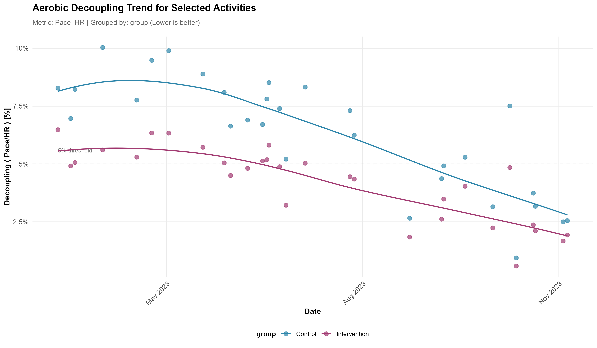

# Athlytics

[](https://cran.r-project.org/package=Athlytics)
[](https://cran.r-project.org/web/views/SportsAnalytics.html)
[](https://cran.r-project.org/package=Athlytics)
[](https://github.com/HzaCode/Athlytics/actions/workflows/R-CMD-check.yml)
[](https://hezhiang.com/Athlytics/)
[](https://app.codecov.io/gh/HzaCode/Athlytics)
[](https://opensource.org/licenses/MIT)
[](https://github.com/firefly-cpp/awesome-computational-intelligence-in-sports?tab=readme-ov-file#software-)
[](https://www.repostatus.org/#active)

## Overview

**Athlytics** is a research-oriented R package for the longitudinal analysis of endurance training. It operates entirely on **local Strava exports** (or FIT/TCX/GPX files), avoiding API dependencies to ensure **privacy** and long-term **reproducibility**.

The package standardizes the workflow from data ingestion and quality control to model estimation and uncertainty quantification. Implemented endpoints include **acute-to-chronic workload ratio (ACWR)**, **aerobic efficiency (EF)**, and **cardiovascular decoupling (pa:hr)**, alongside personal-best and exposure profiles suitable for **single-subject** and **cohort** designs. All functions return tidy data, facilitating statistical modeling and figure generation for academic reporting.

## Key Features

* **Reproducible by design** - Fully offline; no API keys. Deterministic pipelines suitable for longitudinal studies.
* **Validated metrics** - Implements ACWR, EF, and decoupling commonly used in exercise physiology; integrated **QC** checks.
* **Uncertainty-aware** - Functions return estimates with variance/intervals where applicable, enabling principled inference.
* **Cohort support** - Built-in helpers for multi-athlete datasets and percentile-band references.
* **Tidy outputs** - Consistent, analysis-ready tibbles for downstream modeling and figure pipelines.


## 📦 Installation

**1. Stable Release (CRAN)**
```r
install.packages("Athlytics")
```
*Note: The CRAN version may not include the latest features like direct ZIP file support.*

**2. R-Universe**
```r
# Enable repository from r-universe
options(repos = c(
  hzacode = 'https://hzacode.r-universe.dev'))

# Install Athlytics
install.packages('Athlytics')
```

**3. Development Version (GitHub - Recommended)**
```r
# First, install remotes if you don't have it
# install.packages("remotes")

# Install the latest development version from GitHub
remotes::install_github("HzaCode/Athlytics")
```


### 🚀 Quick Start


### 📥 Step 1: Export Your Strava Data

1.  Navigate to **[Strava Settings - My Account](https://www.strava.com/settings/profile)**.
2.  Under "Download or Delete Your Account," click **"Get Started"** and then **"Request Your Archive"**.
3.  You'll receive an email with a download link - this may take some time.
4.  Download the ZIP file (e.g., `export_12345678.zip`). **There is no need to unzip it.**

### 💻 Step 2: Load and Analyze (Cohort Example)

This example shows a common workflow: loading data for several athletes, calculating their training load, and comparing one athlete to the group average.

```r
library(Athlytics)
library(dplyr)

# 1. Load data for a cohort of athletes, adding unique IDs
athlete1 <- load_local_activities("path/to/athlete1_export.zip") %>% mutate(athlete_id = "A1")
athlete2 <- load_local_activities("path/to/athlete2_export.zip") %>% mutate(athlete_id = "A2")
cohort_data <- bind_rows(athlete1, athlete2)

# 2. Calculate ACWR for each athlete in the cohort
cohort_acwr <- cohort_data %>%
  group_by(athlete_id) %>%
  group_modify(~ calculate_acwr(.x, activity_type = "Run", load_metric = "duration_mins")) %>%
  ungroup()

# 3. Generate percentile bands to serve as a reference for the cohort
reference_bands <- cohort_reference(cohort_acwr, metric = "acwr_smooth")

# 4. Plot an individual's data against the cohort reference bands
individual_acwr <- cohort_acwr %>% filter(athlete_id == "A1")
plot_with_reference(individual = individual_acwr, reference = reference_bands)
```


## 📊 Core Analyses

All functions return clean, tidy `tibble` data frames, making it easy to perform your own custom analysis or visualizations.

### Training Load Monitoring (ACWR)

Track how your training load is progressing to avoid ramping up too quickly, which can help in managing injury risk.


*[Learn more about ACWR analysis](https://hezhiang.com/Athlytics/reference/calculate_acwr.html)*

### Aerobic Efficiency (EF)

See how your aerobic fitness is changing over time by comparing your output (pace or power) to your effort (heart rate). A rising trend is a great sign of improving fitness.


*[Learn more about Aerobic Efficiency](https://hezhiang.com/Athlytics/reference/calculate_ef.html)*

### Cardiovascular Decoupling

Measure your endurance by analyzing how much your heart rate "drifts" upward during a steady-state workout. A low decoupling rate (<5%) is a marker of excellent aerobic conditioning.



*[Learn more about Decoupling](https://hezhiang.com/Athlytics/reference/calculate_decoupling.html)*


## 📐 Methods & Validation

This release implements widely used constructs in endurance-exercise analytics:
- **ACWR**: rolling acute (e.g., 7-day) vs chronic (e.g., 28-day) load ratios with smoothing options.
- **Aerobic Efficiency (EF)**: output (pace/power) relative to effort (heart rate) over time.
- **Cardiovascular Decoupling (pa:hr)**: drift between pace/power and heart rate during steady efforts.

We provide input validation, outlier handling, and activity-level QC filters (e.g., minimal duration, HR plausibility ranges). For cohort summarization, Athlytics computes percentile bands and supports stratification by sport, sex, or other covariates when available.


## 📝 Citation

If you use **Athlytics** in academic work, please cite the software as well as the original methodological sources for specific metrics.

```bibtex
@software{athlytics2025,
  title   = {Athlytics: A Reproducible Framework for Endurance Data Analysis},
  author  = {Zhiang He},
  year    = {2025},
  version = {1.0.0},
  url     = {https://github.com/HzaCode/Athlytics}
}
```


## ⚖️ Ethical Considerations

Athlytics processes personal training records. Ensure appropriate consent for cohort analyses, de-identify outputs where required, and comply with local IRB/ethics and data-protection regulations.


## 🤝 Contributing

Contributions are welcome! Please read our [CONTRIBUTING.md](CONTRIBUTING.md) guide and follow our [Code of Conduct](CODE_OF_CONDUCT.md).

*   **🐛 Report an Issue**: [Open an Issue](https://github.com/HzaCode/Athlytics/issues)
*   **💡 Suggest a Feature**: [Start a Discussion](https://github.com/HzaCode/Athlytics/discussions)
*   **🔧 Submit a Pull Request**: We appreciate your help in improving Athlytics.


## 🙏 Acknowledgements

We thank the [pyOpenSci](https://www.pyopensci.org/) community, [Prof. Benjamin S. Baumer](https://github.com/beanumber), and [Prof. Iztok Fister Jr.](https://github.com/firefly-cpp) for their valuable feedback and suggestions.
