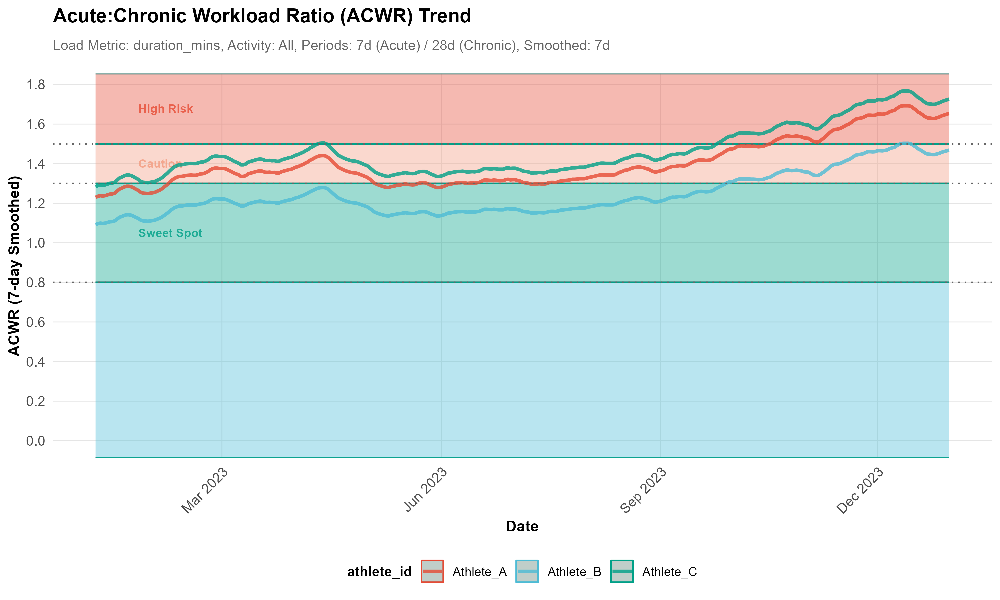

<div align="center">


# Athlytics

*A Comprehensive R Framework for Exercise Physiology Analytics*

[](https://github.com/firefly-cpp/awesome-computational-intelligence-in-sports)
[](https://cran.r-project.org/package=Athlytics)
[](https://cran.r-project.org/package=Athlytics)
[](https://github.com/HzaCode/Athlytics/actions/workflows/R-CMD-check.yml)
[](https://app.codecov.io/gh/HzaCode/Athlytics)
[](https://opensource.org/licenses/MIT)
[](https://hezhiang.com/Athlytics/)

**[📖 Documentation](https://hezhiang.com/Athlytics/)** • **[🚀 Quick Start](#quick-start)** • **[📊 Examples](#core-analyses)** • **[💬 Issues](https://github.com/HzaCode/Athlytics/issues)**

<br>

### 📈 Package Adoption & Growth


*Trusted by researchers, coaches, and athletes worldwide*

</div>

---

## 🎯 Overview

**Athlytics** provides a comprehensive computational framework for longitudinal analysis of exercise physiology metrics using **local Strava data exports**. Designed for sports scientists, coaches, and athletes seeking standardized, reproducible workflows to quantify training load, performance, and physiological adaptation.

### Core Capabilities

- **Training Load Monitoring** — ACWR for injury risk assessment
- **Aerobic Fitness** — Efficiency Factor (EF) analysis  
- **Cardiovascular Metrics** — Decoupling and TSS calculations
- **Privacy-First** — Local processing, no API keys required

> **✨ New in v1.0.0**: Direct ZIP file support — load Strava exports without manual extraction


## ✨ Key Features

### 🔒 Privacy-First Design
Local processing only • No API authentication • Complete data ownership • Works offline

### 📊 Scientific Rigor  
ACWR injury risk monitoring • Efficiency Factor analysis • Cardiovascular decoupling • Training Stress Score

### 📦 Developer Friendly
Direct ZIP loading • Tidy `tibble` output • Extensible architecture • Comprehensive docs

### 📈 Publication Ready
High-quality visualizations • Cohort comparison • Reproducible workflows • Export-ready figures

---

## 📦 Installation

**Stable Release (CRAN)**
```r
install.packages("Athlytics")
```

**Latest Version 1.0.0 (GitHub - Recommended)**
```r
# Install remotes if needed
install.packages("remotes")

# Get the latest v1.0.0 with new features
remotes::install_github('HzaCode/Athlytics')
```

> **💡 Tip**: Version 1.0.0 on GitHub includes direct ZIP file support and enhanced features. CRAN update is pending approval.

---

## 🚀 Quick Start

### 📥 Step 1: Export Your Strava Data

1. Go to [Strava Settings → My Account](https://www.strava.com/settings/profile)
2. Click **"Get Started"** under "Download or Delete Your Account"
3. Select **"Download Request"** ⚠️ *(not Delete Account!)*
4. Wait for email with download link *(usually < 2 hours)*
5. Download the ZIP file (e.g., `export_12345678.zip`)

📖 [Official Strava Export Guide](https://support.strava.com/hc/en-us/articles/216918437) • ⏱️ Processing: 30 min - 2 hours • 📦 Size: 10-500 MB


### 💻 Step 2: Load and Analyze

**🏃 Single Athlete Analysis**

```r
library(Athlytics)

# 1) Load Strava export ZIP (no manual extraction needed)
activities <- load_local_activities("athlete1_export.zip")

# 2) Training Load (ACWR) — run-only to avoid mixing sports
acwr_data <- calculate_acwr(
  activities_data = activities,
  activity_type   = "Run",
  load_metric     = "duration_mins"
)
# Scientific neutrality: risk zones off by default (thresholds are debated)
plot_acwr(acwr_data, highlight_zones = FALSE)

# 3) Aerobic Efficiency (EF)
ef_data <- calculate_ef(
  activities_data = activities,
  ef_metric = "pace_hr"           # Unified lowercase naming
)
plot_ef(ef_data, add_trend_line = TRUE)

# 4) Cardiovascular Decoupling
decoupling_data <- calculate_decoupling(
  activities_data = activities
  # If stream data error occurs, specify export_dir for unzipped export
  # export_dir = "path/to/unzipped_export_dir"
)
plot_decoupling(decoupling_data, decouple_metric = "pace_hr")
```

> **Note:** EF/Decoupling analysis requires **steady-state conditions**. Activities not meeting steady-state thresholds will be automatically skipped or flagged (quality checks recommended before interpreting results).

**👥 Multi-Athlete Cohort Studies**

```r
library(dplyr)

# Load activities for multiple athletes
athlete1 <- load_local_activities("athlete1_export.zip") %>%
  mutate(athlete_id = "athlete1", group = "intervention")

athlete2 <- load_local_activities("athlete2_export.zip") %>%
  mutate(athlete_id = "athlete2", group = "intervention")

athlete3 <- load_local_activities("athlete3_export.zip") %>%
  mutate(athlete_id = "athlete3", group = "control")

# Combine data
cohort_data <- bind_rows(athlete1, athlete2, athlete3)

# Calculate ACWR for each athlete (modern dplyr workflow)
cohort_acwr <- cohort_data %>%
  group_by(athlete_id) %>%
  group_modify(~ calculate_acwr(.x, load_metric = "duration_mins")) %>%
  ungroup()

# Calculate reference percentiles by group
reference_bands <- cohort_reference(
  data   = cohort_acwr,
  metric = "acwr_smooth",
  by     = c("group")
)

# Compare individual athlete against cohort
individual_acwr <- cohort_acwr %>% filter(athlete_id == "athlete1")
plot_with_reference(
  individual = individual_acwr,
  reference = reference_bands
)
```

📚 [Complete Tutorial with Real Examples](https://hezhiang.com/Athlytics/articles/athlytics_introduction.html)

---

## 📊 Core Analyses

> All functions return tidy `tibble` outputs ready for statistical analysis

### 1️⃣ Training Load Monitoring (ACWR)

Monitor training load ramping to identify injury risk periods

**Key Metrics**  
Acute Load (7-day) • Chronic Load (28-day) • ACWR Ratio • Risk zones (0.8-1.3 sweet spot, >1.5 danger)

**Use Cases**  
⚠️ Injury risk prediction • 📈 Training load progression • 🔄 Return-to-play monitoring

```r
# Calculate ACWR
acwr_data <- calculate_acwr(activities_data = activities, load_metric = "duration_mins")

# Visualize with risk zones
plot_acwr(acwr_data, highlight_zones = TRUE)
```

<p align="center">
  
</p>

📖 [ACWR Methodology & Validation](https://hezhiang.com/Athlytics/reference/calculate_acwr.html)

---

### 2️⃣ Aerobic Efficiency (EF)

Track aerobic fitness adaptations over time

**Key Metrics**  
Pace/HR Ratio (runs) • Power/HR Ratio (cycling) • Normalized Power efficiency • Fitness trend analysis

**Use Cases**  
🏃 Aerobic base development • 📊 Training effectiveness • 🎯 Periodization monitoring

```r
# Calculate Efficiency Factor
ef_data <- calculate_ef(activities_data = activities, ef_metric = "pace_hr")

# Plot with trend line
plot_ef(ef_data, add_trend_line = TRUE)
```

<p align="center">
  
</p>

📖 [Efficiency Factor Theory](https://hezhiang.com/Athlytics/reference/calculate_ef.html)

---

### 3️⃣ Cardiovascular Decoupling

Quantify cardiovascular drift during endurance efforts

**Key Metrics**  
First vs second half comparison • Decoupling percentage • Quality thresholds (<5% excellent) • Aerobic endurance indicator

**Use Cases**  
🔬 Aerobic fitness assessment • 🌡️ Heat/fatigue adaptation • 📉 Overtraining detection

```r
# Calculate decoupling
decoupling_data <- calculate_decoupling(activities_data = activities)

# Visualize trends
plot_decoupling(decoupling_data, decouple_metric = "pace_hr")
```

<p align="center">
  
</p>

📖 [Decoupling Analysis Guide](https://hezhiang.com/Athlytics/reference/calculate_decoupling.html)

---

## 🔬 Advanced Features

**📊 Statistical Analysis**  
Cohort comparison • Quality flagging • Statistical testing • Anomaly detection

**🎯 Performance Tracking**  
Personal bests (PR detection) • Training stress balance • Fitness-fatigue dynamics • Periodization tools

📚 [Explore Advanced Features with Examples](https://hezhiang.com/Athlytics/articles/advanced_features.html)

---

## 📝 Citation

If you use **Athlytics** in your research, please cite:

```bibtex
@software{athlytics2025,
  title   = {Athlytics: An R Framework for Longitudinal Analysis of Exercise Physiology},
  author  = {Zhiang He},
  year    = {2025},
  version = {1.0.0},
  url     = {https://github.com/HzaCode/Athlytics}
}
```

> **Note**: Also cite original methodological papers for specific metrics used (see documentation)

---

## 🤝 Contributing

We welcome contributions from the community!

**🐛 Report Issues** → [Open an Issue](https://github.com/HzaCode/Athlytics/issues)  
**💡 Suggest Features** → [Start a Discussion](https://github.com/HzaCode/Athlytics/discussions)  
**🔧 Submit Code** → Read [CONTRIBUTING.md](CONTRIBUTING.md)  
**📖 Guidelines** → Follow our [Code of Conduct](CODE_OF_CONDUCT.md)

---

<div align="center">

## 🔗 Links & Resources

**[📖 Documentation](https://hezhiang.com/Athlytics/)** • **[🐙 GitHub](https://github.com/HzaCode/Athlytics)** • **[❓ Issues](https://github.com/HzaCode/Athlytics/issues)** • **[💬 Discussions](https://github.com/HzaCode/Athlytics/discussions)** • **[📦 CRAN](https://cran.r-project.org/package=Athlytics)**


</div>
